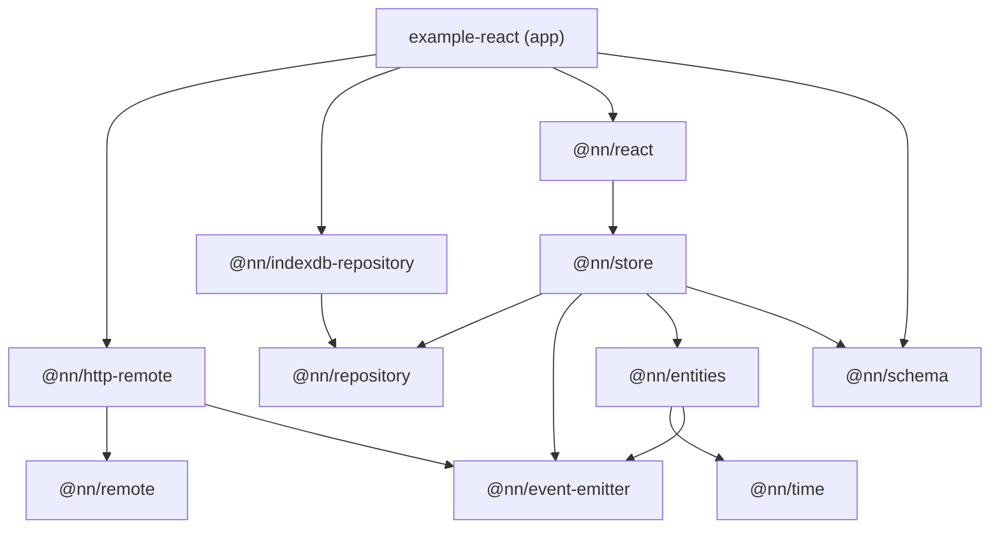

# Package dependencies

Runtime dependency graph of the `packages/` workspace. `@nn/typescript-config` is
omitted — it is a devDependency of every package and carries no runtime code.

## Notes

- The graph is acyclic. `@nn/event-emitter` has the most consumers (`@nn/store`,
  `@nn/entities`, `@nn/http-remote`).
- `@nn/time`, `@nn/event-emitter`, `@nn/remote`, `@nn/repository` and `@nn/schema`
  are leaves — they depend on nothing inside the workspace.
- `@nn/http-remote` and `@nn/indexdb-repository` are adapters implementing the
  `@nn/remote` and `@nn/repository` abstractions. No library package depends on
  them — the application wires them in, as `apps/example-react` does.
- `apps/example-server` depends on no workspace package.
- Not drawn above, because they are declared as devDependencies:
  - `@nn/react` → `@nn/entities` — genuinely dev-only (test fixtures).
  - `@nn/store` → `@nn/remote` and `@nn/react` → `@nn/remote`, `@nn/repository`,
    `@nn/schema` — these are `import type` in `src/`, not in tests. Because every
    package exports raw `./src/*.ts`, a consumer compiles that source and must be
    able to resolve them, so they belong in `dependencies`.
